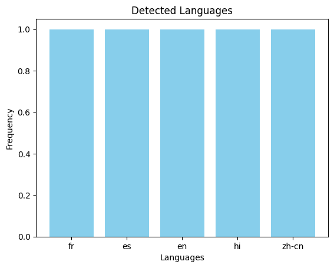

# Detecting Languages with Python: A Step-by-Step Guide

Language detection is a key tool in text analytics, enabling researchers to classify documents, messages, and other textual data into their respective languages. With the rise of social media and globalization, detecting languages in multilingual datasets is essential for insights in fields like social sciences, marketing, and natural language processing (NLP). In this tutorial, we will explore how to perform language detection using Python and the langdetect library in a Jupyter Notebook environment [Language-Detection-Tutorial.ipynb](Language-Detection-Tutorial.ipynb).

## Learning Objectives
By the end of this tutorial, you will be able to:

- Understand the basics of language detection.
- Set up a Python environment for language detection tasks.
- Implement a simple language detection tool using Python libraries.
- Evaluate the detected languages for datasets and real-world use cases.

## Target Audience
This tutorial is designed for:

- Researchers in social sciences and linguistics interested in multilingual data analysis.
- Students or professionals beginning their journey in NLP.
- Data analysts working with diverse language datasets.
- Anyone curious about language detection tools in Python.

## Duration
1 Hour

## Social Science Use Cases
**Survey Analysis:** Determine the primary languages in multilingual survey responses.

**Media Studies:** Analyze the distribution of languages in social media posts or news articles.

## Setting Up the Computational Environment
```
pip install langdetect pandas matplotlib
```



Want to know more, switch to the full tutorial at [Language Detection Tutorial.ipynb](Language-Detection-Tutorial.ipynb)
## Technical Details

This tutorial leverages the [`langdetect`](https://github.com/Mimino666/langdetect) library, a port of Google's language-detection library, to identify the language of given text samples. The code is organized in a Jupyter Notebook for interactive exploration and reproducibility.

Key components include:

- **Language Detection:** Using `langdetect.detect()` to predict the language code (e.g., 'en', 'fr', 'es') for each text entry.
- **Batch Processing:** Applying detection to entire columns in a pandas DataFrame for efficient analysis of datasets.
- **Error Handling:** Managing exceptions for empty or ambiguous text inputs to ensure robust results.
- **Visualization:** Summarizing detected language distributions with matplotlib for quick insights.

All code and sample data are provided in the [Language-Detection-Tutorial.ipynb](Language-Detection-Tutorial.ipynb) notebook, making it easy to adapt the workflow to your own datasets.

## Key Takeaways

- The tutorial demonstrates how to process and analyze multilingual datasets efficiently using pandas and visualize results with matplotlib.
- The provided Jupyter Notebook serves as a practical template for integrating language detection into your own projects.
- Understanding language distribution in your data can unlock valuable insights for research, analytics, and NLP applications.

## Contact Details
susmita.gangopadhyay@gesis.org